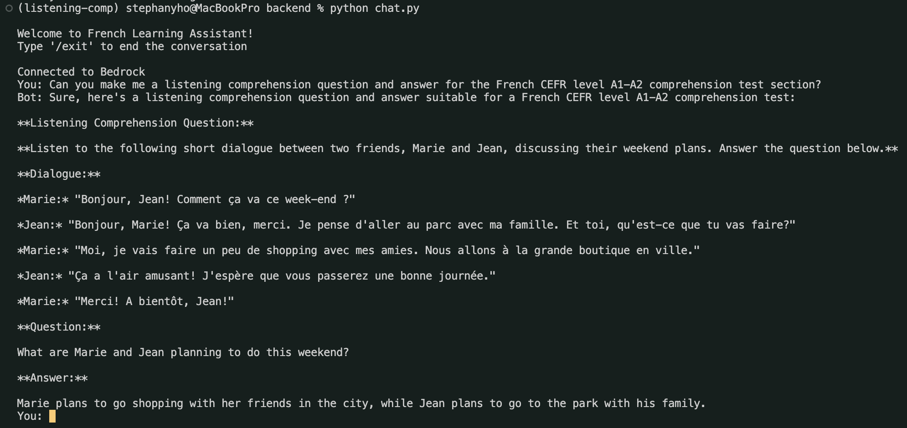

## How to run frontend

```sh
streamlit run frontend/main.py
```

## How to run backend

```sh
cd backend
pip install -r requirements.txt
cd ..
python backend/main.py
```

## Journal

### Chat with Nova

#### Amazon Bedrock Setup

I created a `~/.aws/credentials` file with the following content:

```text
[default]
region = your-region
aws_access_key_id = your-access-key-id
aws_secret_access_key = your-secret-access-key
```

Back in the AWS console, I navigated to **Amazon Bedrock** service and requested access to all models available so I can experiment. I navigated back to **IAM** service and added the `AmazonBedrockFullAccess` policy to my IAM user.

Below is the screenshot of the chat example with Nova:


### Raw Transcript

### Structured Data

### RAG Implementation

### Interactive Implementation
