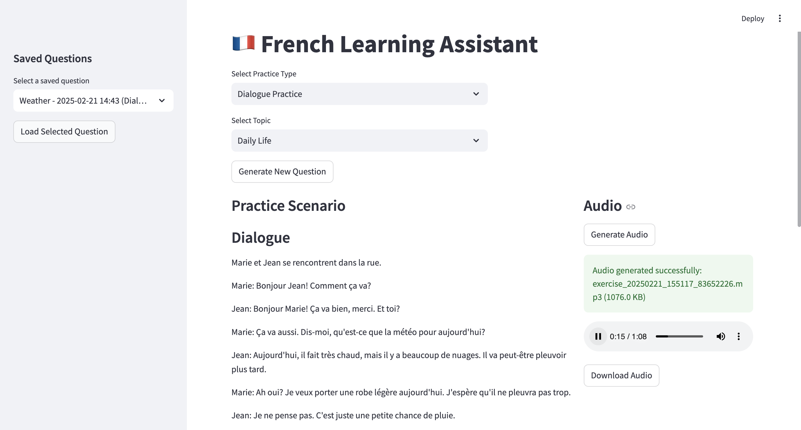
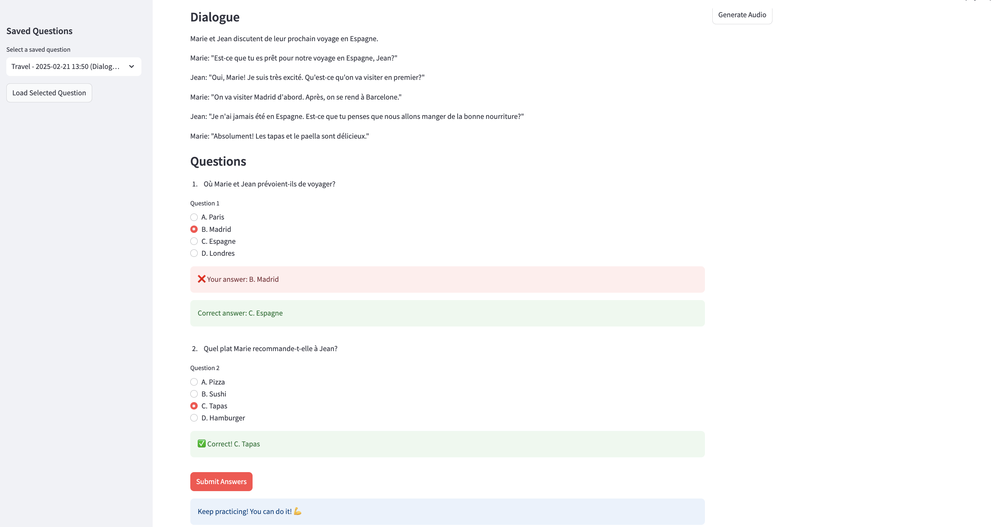

# Listening Comprehension App

A streamlit-based application that helps users practice French listening comprehension. The app generates dialogues on various topics, creates comprehension questions, and synthesizes audio to improve listening skills. It uses Amazon Bedrock for content generation and Amazon Polly for text-to-speech.

## How to run frontend

```sh
streamlit run frontend/main.py
```

## How to run backend

```sh
cd backend
pip install -r requirements.txt
cd ..
python backend/main.py
```

## Journal

### Amazon Bedrock

In this application, I used Amazon Bedrock, specifically the `Nova` model to generate the dialogue and the questions. I created a `~/.aws/credentials` file with the following content:

```text
[default]
region = your-region
aws_access_key_id = your-access-key-id
aws_secret_access_key = your-secret-access-key
```

Back in the AWS console, I navigated to **Amazon Bedrock** service and requested access to all models available so I can experiment. I navigated back to **IAM** service and added the `AmazonBedrockFullAccess` policy to my IAM user.

Below is the screenshot of the chat example with Nova:


### Raw Transcript

Add `youtube_transcript_api` to the `requirements.txt` file. The file `get_transcript.py` is used to get the transcript from the YouTube video.

### Structured Data

The structured data processing will include dialogue extraction and structured data. Created the `structured_data.py` file to process the structured data.

The `vector_store.py` file is used to create a vector store from the structured data and `question_generator.py` file to generate questions from the structured data. The generated questions are then saved automatically in the `data/saved_questions` directory in file named `questions.json` in JSON format.

### Amazon Polly

For audio generation, I ran `brew install ffmpeg` and added ffmpeg-python to the `requirements.txt` file. I implemented audio generator in `audio_generator.py` file with Amazon Polly, the generated audio files will be saved automatically in the `data/audio` directory.

To use **Amazon Polly**, navigate to the IM service in AWS console, add the `AmazonPollyFullAccess` policy and add the credentials to the `~/.aws/credentials` file.

Here shows an audio for the dialogue and the questions is generated.


Here shows the UI for thequestions and the correct answers.

