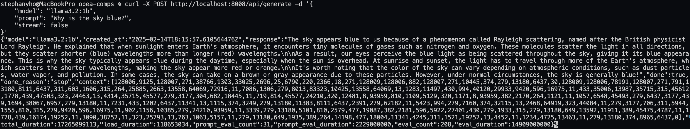

## Running Ollama Third-Party Service

### Choosing a Model

You can get the model_id that ollama will launch from the [Ollama Library](https://ollama.com/library)

eg. https://ollama.com/library/llama3.2

### Getting the Host IP

#### Linux

Get your IP address (it is under `en0`). Or try `${hostname -I | awk '{print $1}'}`

```bash
sudo apt install net-tools
ifconfig
```

NO_PROXY=localhost
LLM_ENDPOINT_PORT=9000 LLM_MODEL_ID="llama3.2:1b"
host_ip=<your_host_ip> docker compose up

### Ollama API

Once the Ollama server is running, we can make API calls to the Ollama API.

https://github.com/ollama/ollama/blob/main/docs/api.md

## Download (Pull) a Model

```bash
curl http://localhost:9000/api/pull -d '{
    "model": "llama3.2:1b"
}'
```

## Generate a Request

Add `"stream": false` to tell the API to wait until the entire response is ready and send it all at once, else it will stream the response and send back word by word (or token by token).

```bash
curl -X POST http://localhost:9000/api/generate -d '{
    "model": "llama3.2:1b",
    "prompt": "Why is the sky blue?",
    "stream": false
}'
```

Here is the response I got back from Ollama:



## Technical Uncertainty

Q: Does bridge mode mean we can only access Ollama API with another model in the docker compose?

A: No, the host machine will be able to access it.

Q: Which port is being mapped: 0.0.0.0:8008->11434/tcp?

A: In this case, 8008 is the port that host machine will accesss. The other one is the guest port, which is the port of the service inside container.

Q: If we pass the LLM_MODEL_ID to the ollama server, will it download the model on start?

A: It does not appear so. The Ollama CLI might be running multiple APIs so you need to call the pull api before trying to generate text.

Q: Will the model be downloaded in the container? Does that mean the ML model will be deleted when the container stops running?

A: The model will download into the container and vanish when the container stop running. We need to mount a local drive and there is probably more work to be done.

Q: For the LLM service which can perform text-generation, it suggests it will only work with TGI/vLLM and all we have to do is have it running. Does TGI and vLLM have a standarized API or is there code to detect which one is running? Do we really have to use Xeon or Gaudi processor?

A: vLLM, TGI (Text Generation Inference), and Ollama all offer APIs with OpenAI compatibility, so in theory they should be interchangable.
