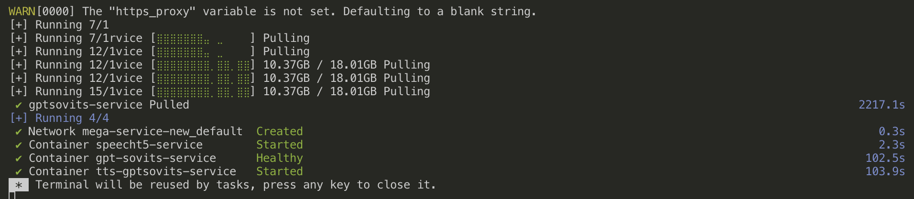

## Mega-Service-New

### Business Goal

We will explore how to run the AI workloads completely in containers or kubernetes, and learn to work with the building blocks to construct our own Gen AI workloads running on containers.

### Technical Uncertainty

- Using OPEA does it serve the model via a LLM server?
- How do we orchestrate two services together?
- What is the quality of build across the various OPEA Comps?

### Technical Restrictions

- [GenAIComps](https://github.com/opea-project/GenAIComps)
- [OPEA Comps Project](https://opea-project.github.io/latest/GenAIComps/README.html)
- Docker Containers

### Journal

We went over the TTS (Text-To-Speech) microservice, running the `gptsovits-service` image with docker compose.

[GPT-SoVITS](https://github.com/RVC-Boss/GPT-SoVITS)

The `opea/gpt-sovits` image size was about 23.98GB, which on and off it took me about an hour to pull it down since my local machine only has 8GB RAM.

After I get the TTS microservice running, I created the ./bin/gptsovits-10s file, ran `chmod u+x ./bin/gptsovits-10s` to make it executable, and ran `./bin/gptsovits-10s`. The result varies each time with different tones of saying 'This is a new sentence I want to convert to speech', and sometimes it is not as clear. I tried to change the "prompt_text" to an actual prompt and asked to translate a sentence for "text" and modifed the "text_language" but it did not work. It might be a syntax problem that I will have to revisit in the future.
