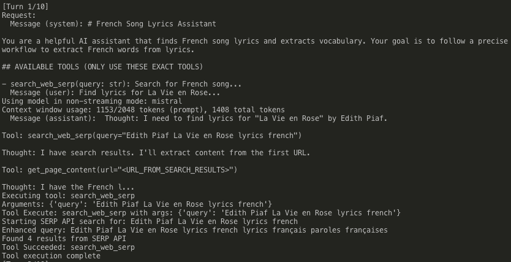
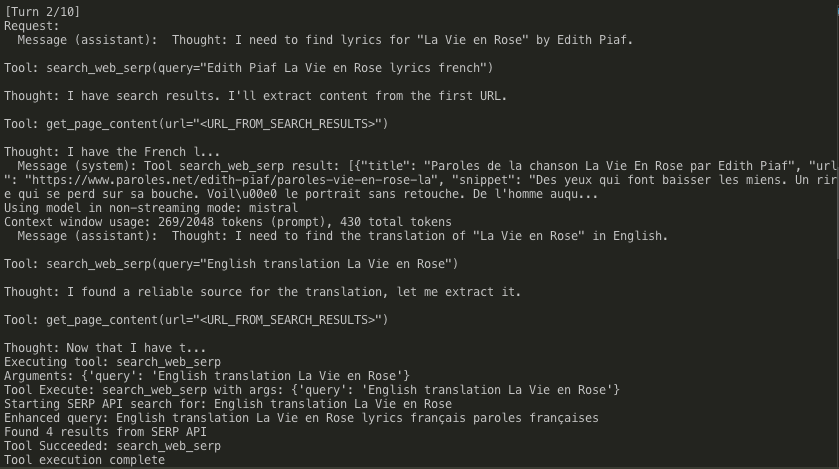
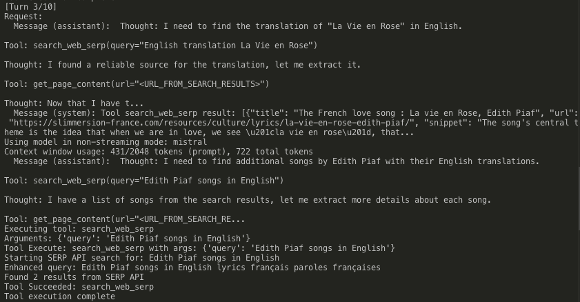
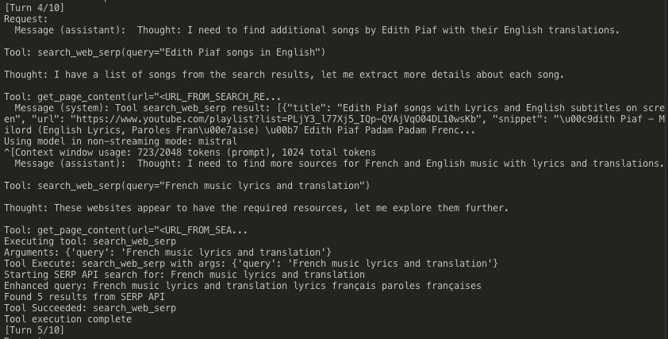
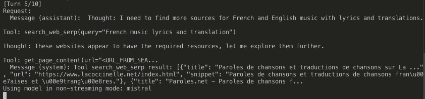

## Install Ollama and choose a model

For MacOS, install Ollama and choose a model, in this case Mistral:

```sh
# install and run Ollama
brew install ollama
ollama serve

# pull model in another terminal
ollama run mistral
```

## How to run the server

```sh
uvicorn main:app --reload
```

## How to use the api

```sh
curl -X POST http://localhost:8000/api/agent \
    -H "Content-Type: application/json" \
    -d '{
        "message_request": "Find lyrics for La Vie en Rose"
    }'

# or simple run
./bin/post
```

## Journal

I was able to start the agent with Mistral, however, I had to refactor code multiple times to get it working correctly. At first it was making up the lyrics content and I found out it was missing the SERP_API_KEY. I also revised the Lyrics-Agent.md prompt so it has a clearer idea of what to do, but it still goes off track and improvise, using tools that don't exist... Other problems I had was with my local machine, it is not powerful enough so it took a long while before it returns something back and evetually I had to stop it before it finishes the task.

In my most recent run, the agent is still going off track, trying to translate English content and find synonyms rather than following the prescribed workflow. Another run it starts to search for translations and additional songs by the said artist.

Here is an example of the responses I got back from one of the agent runs. It seemed like it found the lyrics in turn 2/10, however it starts going off track and looks for translation of the song, and then additional songs by the said artist, and then further to find more sources for French and English music with lyrics and translations...






