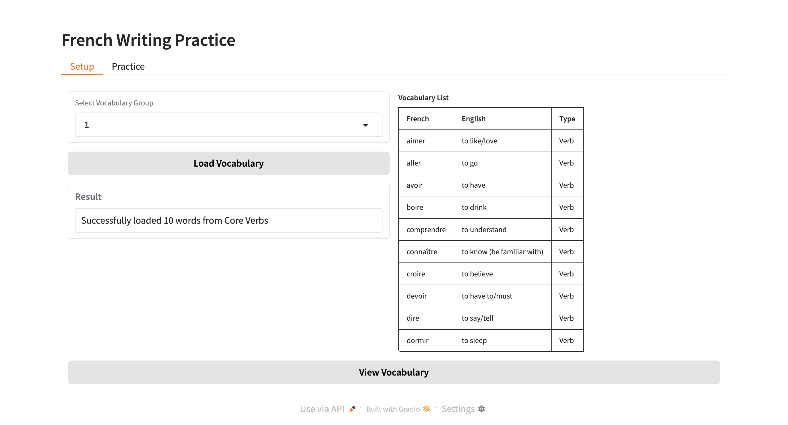
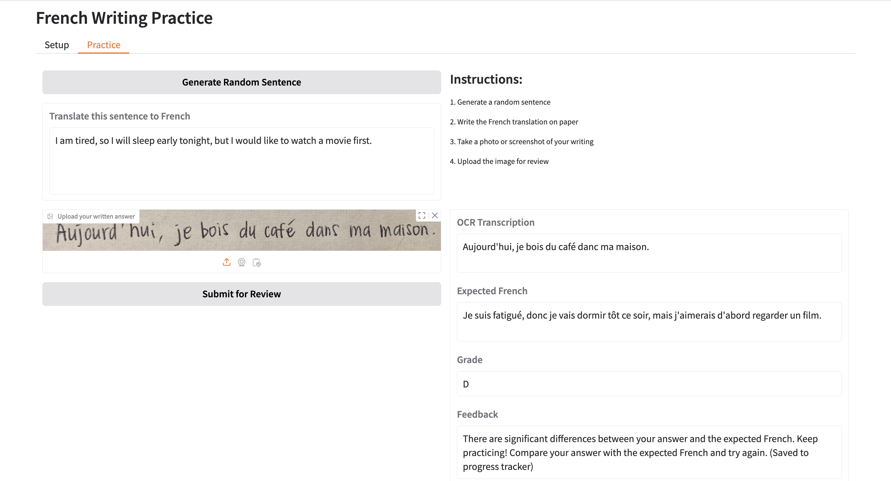
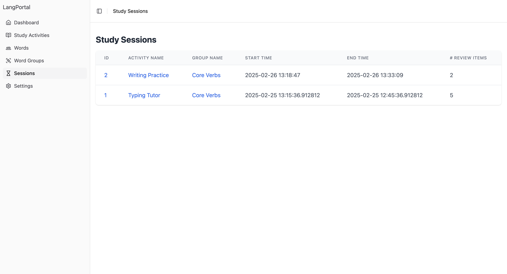

# Writing Practice

## Business Goal

Build a learning exercisse to practice writing language sentences, a prototyping application which will take a word group, and generate very simple sentences in English.

## Technical Requirements

- Gradio
- Pytesseract
- OpenAI API
- Be able to upload an image

## How to Start

1. Start the backend:
   - Navigate to `lang-portal/backend-flask`
   - Run `python app.py`
2. Start the Writing Practice:
   - Navigate to `writing-practice`
   - Make sure you have Tesseract installed locally. Check if `fra` is available in your language list:
     ```bash
        brew install tesseract
        tesseract --list-langs
     ```
   - Install dependencies with `pip install -r requirements.txt`
   - Set up your OpenAI API Key in `.env`:
     ```text
     OPENAI_API_KEY=your_openai_api_key
     ```
   - Run `gradio gradio_app.py`

## Journal

Originally I tried building this activity with Streamlit, but debugging and console logging was a challenge so I switched to Gradio.

Below are the screenshots of the Setup page and the Practice page. I used `Pytesseract` as the OCR tool for the French language.

On the Setup page, there are 3 sets of word groups in the pull down list (core verbs, core nouns, and core adjectives), click the "Load Vocabulary" button and it will generate a list of words from the selected word group.

On the Practice page, click the "Generate Random Sentence" button to generate a random compound sentence that is within the DELF A2-B1 level French. Student will have to upload an image of their translated sentence and click "Submit for Review" button. Then, on the right side it will generate an OCR transcription, the expected answer, a grade, and a feedback.

When student is done with the Writing Practice, the session will be saved to the Lang-Portal frontend Study Sessions.






